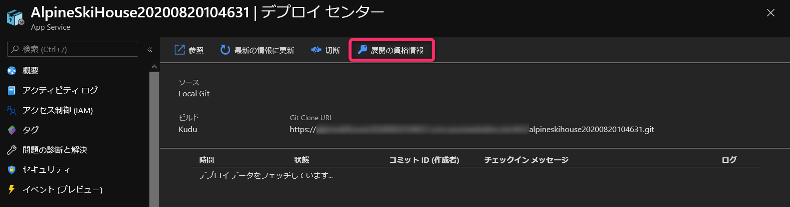

# learn-stage-deploy-app-service-deployment-slots

## デプロイセンターと資格情報の確認

   

ローカル Git を確定後に資格情報を確認する。  

     

   

## GitHub Action を利用する場合 

   

初回のみですが、GitHub と Azure AppService の認証が必要な場合。  
   

   

   

   
